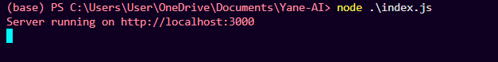

# Yane-AI
<h2> Image Tagging API with Clarifai </h2>

This project is a Node.js server application that leverages the Clarifai AI platform to analyze images and automatically generate descriptive tags. 

It exposes a simple REST API where clients can send an image URL and receive a list of tags that describe the content of the image.

🌼Features : - 
- Accepts image URLs via a POST API endpoint.
- Uses Clarifai’s General Image Recognition model to analyze images.
- Returns a JSON array of tags (concepts) detected in the image.
- Easy to extend for other Clarifai models or input types.
- Handles errors gracefully and validates API responses.

🌼<b>Installation</b>
- Clone the Repo
- install dependencies 
npm install express clarifai-nodejs-grpc dotenv

- Create a .env file in the project root and add your Clarifai API key:

CLARIFAI_API_KEY=your_personal_access_token_here

🌼<b>Running the Server</b>
- Start the server with:
node index.js

- You should see:
Server running on http://localhost:3000

🌼<b> API Usage </b>
- Endpoint
POST /analyze
Content-Type: application/json

🌼<b> Request Body </b>
Send a JSON object with the image URL:

{
  "url": "https://samples.clarifai.com/metro-north.jpg"
}

🌼<b> Response </b>

{
  "tags": [
    "train",
    "railway",
    "transportation",
    "vehicle",
    "track",
    "station",
    "railroad",
    "travel",
    "city",
    "urban"
  ]
}

🌼How It Works : - 
- The server receives the image URL from the client.
- It calls Clarifai’s General Image Recognition model with the URL.
- Clarifai returns a list of concepts detected in the image.
- The server extracts and returns these tags as JSON.

🌼Error Handling : - 
- If the Clarifai API returns an error or invalid response, the server responds with HTTP 500 and an error message.
- The server logs detailed Clarifai responses for debugging.

🌼Extending the Project : -
- Change the Clarifai model by updating the model_id and model_version_id.
- Add support for local image uploads by integrating file handling.
- Create a frontend to visualize images and their tags.
- Implement caching to reduce API calls for repeated images.

🌼Dependencies : -

- express - Web framework for Node.js. (https://www.npmjs.com/package/express)

- clarifai-nodejs-grpc - Clarifai’s gRPC client. (https://www.npmjs.com/package/clarifai-nodejs-grpc)

- dotenv - Loads environment variables from .env. (https://www.npmjs.com/package/dotenv)